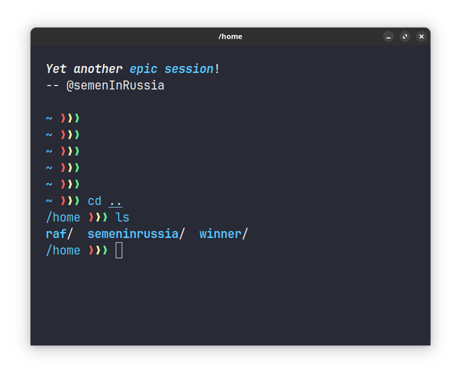

My brrruuuh config of Arch
---

Here I place all my dotfiles (but without Emacs, because it in separated [repository](https://github.com/semeninrussia/emacs.el)).

You can find here my config of my shell ([fish](https://fishshell.com/)) + terminal ([alacritty](https://alacritty.org/ "GPU terminal"))



my config for editors which I rarely use:

- [Code](https://devrant.com/rants/5333874/my-biggest-problem-with-visual-studio-code-is-that-every-fucking-piece-of-shit-d)
- [Helix](https://helix-editor.com/)


and other things in the majority Linux things like [bat](https://github.com/sharkdp/bat)

## Install


If you already install all things that I configure installation is easily:

1. Install `stow` using anything like `pacman -S stow`
1. Cloning this repo `git clone https://github.com/semenInRussia/brruh.git`
2. Sync this config using `stow .` (so stow installation is also needed before)

Note: that stow can you say anything like "I found conflicts", it's ok and tells that stow can't automatically erase your configuration files (because it isn't safe) YOU MUST ERASE YOUR CONFIG FILES BEFORE, I suggest you to save your config to other directory, in it you also can `stow` btw

Also note: that you can use only part of my config files for it just don't install extra packages (for example you don't use helix, to don't use my config files of Helix just don't install Helix) or if you need to use your Helix config just remove the Helix directory from my dotfiles it's ok

## Uninstall

Inside `brruh` directory execute the following easy `stow` command:

```shell
stow -D .
```

Easily i think
